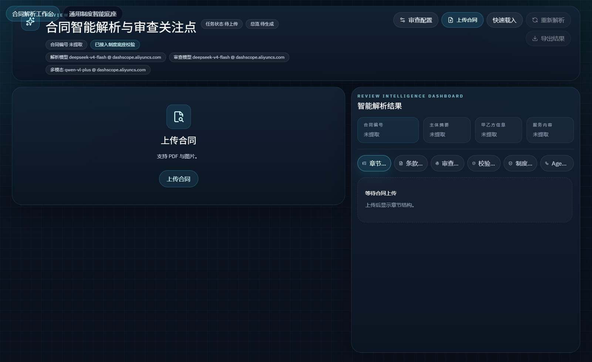
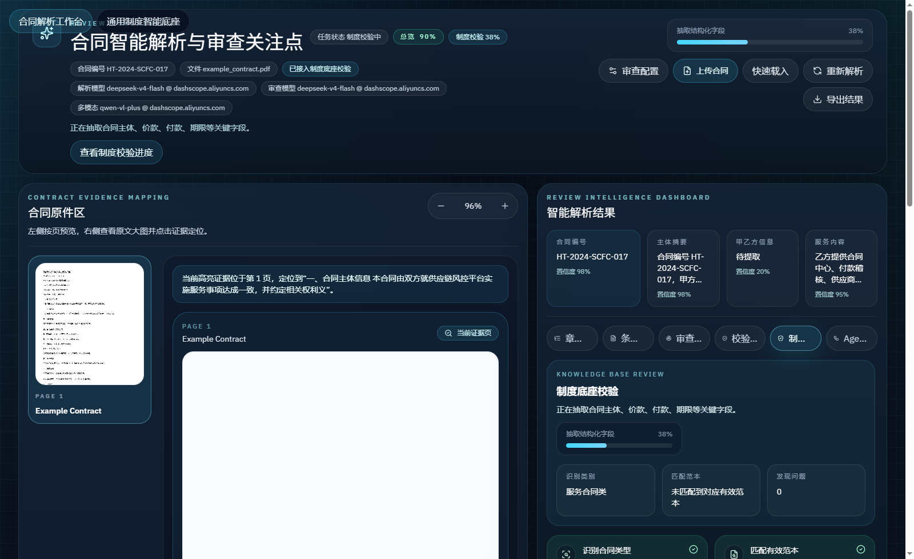
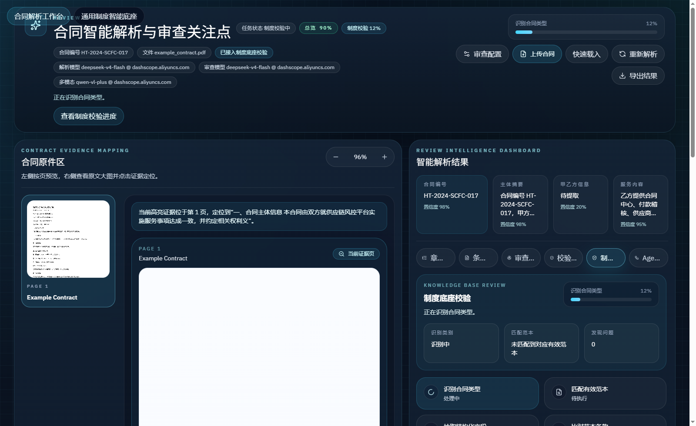
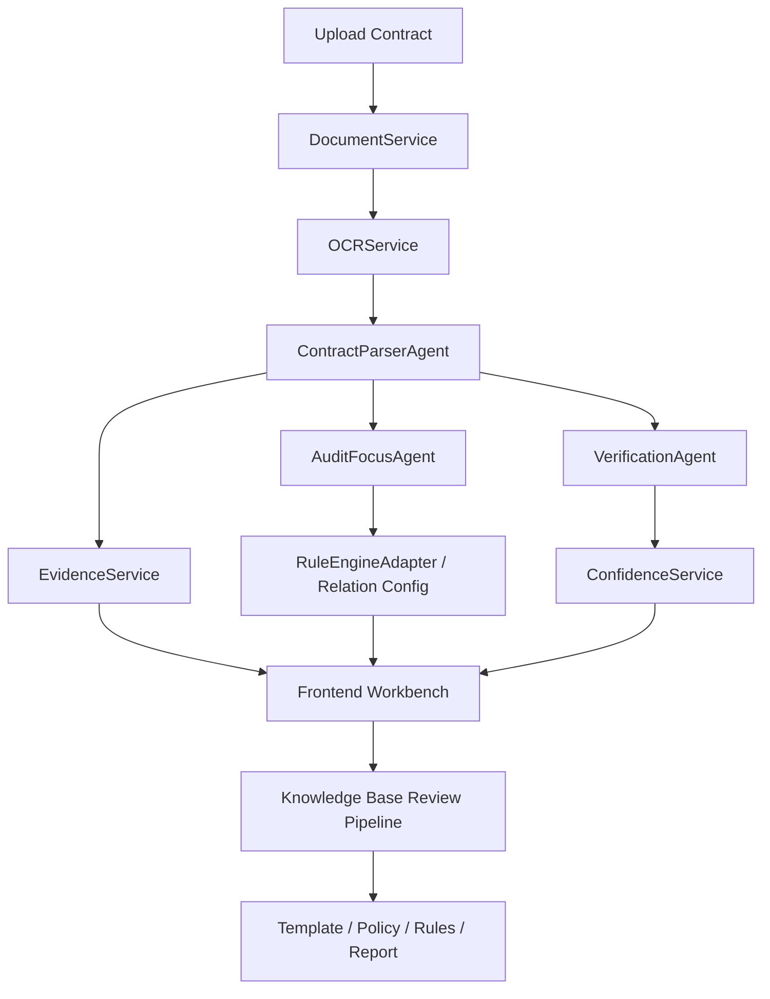

# Audit Agent Demo Kit

[](https://github.com/teachershuang/Audit-Agent-Demo-Kit/stargazers)
[](https://github.com/teachershuang/Audit-Agent-Demo-Kit/network/members)
[](https://github.com/teachershuang/Audit-Agent-Demo-Kit/issues)
[](./LICENSE)
[](https://fastapi.tiangolo.com/)
[](https://vitejs.dev/)

面向审计 / 风控场景的合同智能理解与制度审查 Agent 工作台。

项目包含两个共享同一后端的工作区：
- 合同智能解析工作台：上传合同，完成 OCR / 结构理解 / 条款抽取 / 证据定位 / 审计关注点生成。
- 智能审查底座：管理制度、范本和规则，把合同结果进一步映射到制度依据、范本比对和规则校验。

如果这个项目对你有帮助，欢迎点一个 [Star](https://github.com/teachershuang/Audit-Agent-Demo-Kit/stargazers)。

## Screenshots

### 合同解析工作台


### 解析结果与证据联动


### 高信息密度工作台视图


## Why This Project

这个仓库不是简单的 OCR 页面，也不是固定规则审查器。它的目标是把下面几件事放到同一个可演示、可扩展的 Agent 工作流里：

- 合同结构理解：从原始 PDF / 图片中恢复章节、条款和业务结构。
- 证据可回溯：模型输出必须能回到合同原文和高亮区域。
- 审计关注点生成：输出的是“关注方向 / 待核验事项”，不是黑盒结论。
- 规则与关系扩展：为规则引擎、知识图谱、企业关系库、外部 API 预留统一接入点。
- 制度审查联动：不仅看合同文本，还能进一步映射范本、制度依据和规则命中。

## Core Features

### 合同解析工作台
- PDF / 图片合同上传
- 扫描件与文字件双链路解析
- 章节还原
- 条款标签识别
- 关键信息抽取
- 证据定位与左右联动高亮
- 审计配置驱动的关注点生成
- 模型档位切换：公网 / 内网
- Agent 过程日志与校验面板

### 智能审查底座
- 制度 / 范本 / 规则入库
- 文档版本管理
- 模板匹配与条款比对
- 制度依据检索
- GoRules / 外部规则引擎适配
- 审查报告汇总与预览

## Project Structure

```text
backend/
  app/
    agents/        # 合同解析、审计关注点、校验等 Agent
    api/           # 制度底座相关 API
    prompts/       # Prompt 模板
    reviewer/      # 制度审查流水线
    routers/       # FastAPI 路由
    services/      # OCR、Qwen、证据定位、运行时模型切换等
    tools/         # 规则引擎 / 外部适配器
frontend/
  src/
    components/    # 合同查看、条款卡片、配置面板等
    pages/         # 智能审查底座页面
    services/      # 前端 API 层
    store/         # Zustand 状态管理
docs/
  api.md
  architecture.md
  quickstart.md
  screenshots/
scripts/
  start_backend.ps1
  start_frontend.ps1
  start_all.ps1
```

## Tech Stack

- Frontend: React, Vite, TypeScript, Tailwind CSS, Framer Motion, Zustand
- Backend: FastAPI, Pydantic, Uvicorn, httpx
- Document Processing: PyMuPDF, Pillow, Python DOCX
- Models: Qwen-compatible OpenAI API, DeepSeek-compatible text model, optional internal profile
- Retrieval / Rule Layer: Redis, embeddings, GoRules adapter, external knowledge hooks

## Quick Start

详细说明见 [docs/quickstart.md](./docs/quickstart.md)。

### 1. Environment

推荐 Python 环境：

```powershell
conda create -n contract_audit_base python=3.11 -y
conda activate contract_audit_base
```

安装后端依赖：

```powershell
pip install -r .\backend\requirements.txt
```

安装前端依赖：

```powershell
cd .\frontend
npm install
cd ..
```

### 2. Configure

复制环境变量模板：

```powershell
Copy-Item .env.example .env
```

至少补齐：
- `QWEN_API_KEY`
- `QWEN_BASE_URL`
- `QWEN_MODEL_NAME`
- `LLM_API_KEY`
- `LLM_BASE_URL`
- `LLM_MODEL`

如果你有内网模型链路，也可以补齐：
- `INTERNAL_QWEN_API_KEY`
- `INTERNAL_QWEN_BASE_URL`
- `INTERNAL_QWEN_MODEL_NAME`
- `INTERNAL_PADDLE_REMOTE_BASE_URL`

### 3. Start

一键启动：

```powershell
powershell -ExecutionPolicy Bypass -File .\scripts\start_all.ps1
```

默认地址：
- Frontend: [http://127.0.0.1:5173](http://127.0.0.1:5173)
- Backend: [http://127.0.0.1:8010](http://127.0.0.1:8010)

## Runtime Modes

项目支持运行时模型档位切换：

- 公网模型
  - 文本：`deepseek-v4-flash`
  - 多模态：`qwen-vl-plus`
  - 适合标准演示与扫描件识别
- 内网模型
  - 文本：`Qwen3.6-35B-A3B-GGUF`
  - OCR：内网 Paddle 服务
  - 适合内网受限环境部署

前端顶部可直接切换档位，并实时展示文本模型、多模态状态和 OCR 状态。

## API Overview

完整 API 见 [docs/api.md](./docs/api.md)。

关键接口：

```text
POST /api/contracts/upload
POST /api/contracts/{task_id}/analyze
GET  /api/contracts/{task_id}
GET  /api/contracts/{task_id}/result

GET  /api/config/relations
POST /api/config/relations
PUT  /api/config/relations/{relation_id}
DELETE /api/config/relations/{relation_id}

POST /api/runtime/model-profiles/switch
POST /api/audit/generate
```

## Architecture

详细架构说明见 [docs/architecture.md](./docs/architecture.md)。

核心链路：



## Logging

日志目录默认在：

- `.\.run-logs\backend.app.log`
- `.\.run-logs\frontend.app.log`
- `.\.run-logs\sessions\*.stdout.log`
- `.\.run-logs\sessions\*.stderr.log`

日志内容包含：
- 前后端请求参数摘要
- 模型调用耗时
- 规则引擎请求 / 返回记录
- 解析任务阶段进度
- 错误与异常堆栈

## Open Source Roadmap

- 更稳定的扫描件多阶段解析
- 更强的跨页条款引用结构化
- 知识图谱 / 企业关系数据接入
- GoRules / DMN / 自定义规则市场
- 人工复核编排与审计闭环

## Documents

- [Quick Start](./docs/quickstart.md)
- [Architecture](./docs/architecture.md)
- [API](./docs/api.md)
- [Support](./SUPPORT.md)
- [Contributing](./CONTRIBUTING.md)

## License

本项目采用 [MIT License](./LICENSE)。
