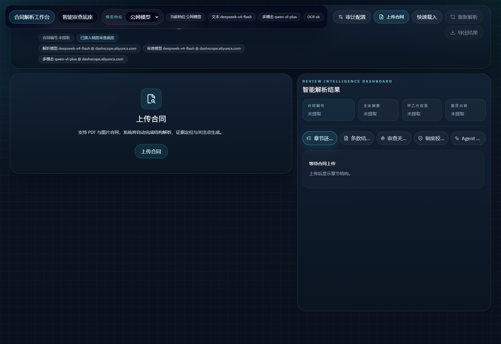
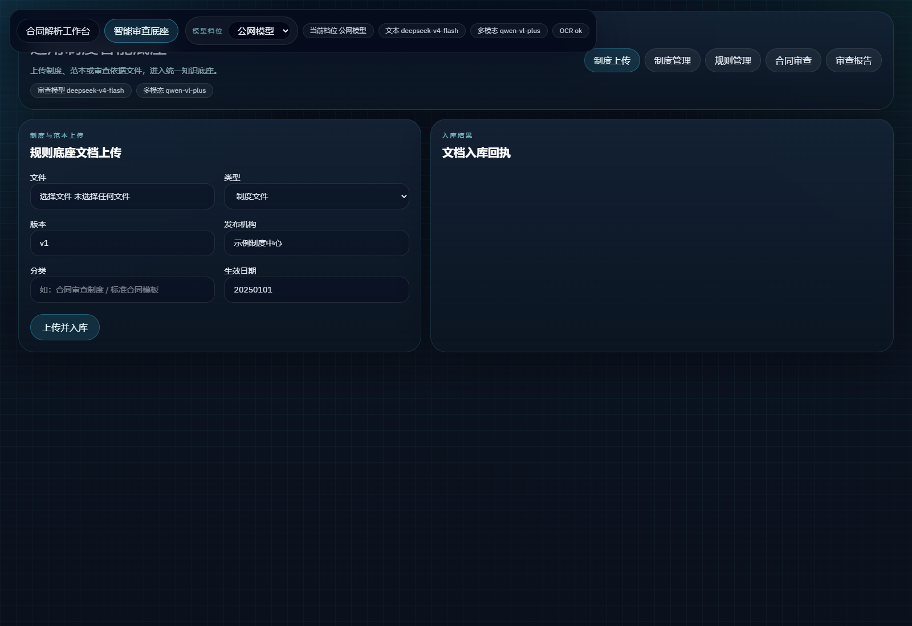
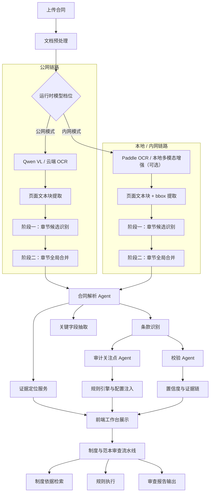

# 合同审查 Agent Demo Kit

[](https://github.com/teachershuang/Audit-Agent-Demo-Kit/stargazers)
[](https://github.com/teachershuang/Audit-Agent-Demo-Kit/network/members)
[](https://github.com/teachershuang/Audit-Agent-Demo-Kit/issues)
[](./LICENSE)
[](https://fastapi.tiangolo.com/)
[](https://vitejs.dev/)

一个面向审计、风控、制度核验场景的合同智能解析与规则底座演示项目。

本仓库包含两部分能力：

- 合同智能解析工作台：合同上传、章节还原、条款识别、证据定位、审计关注点生成、规则校验结果展示。
- 智能审查规则底座：制度文档上传、标准条款沉淀、规则管理、合同制度审查与规则执行联调。

如果这个项目对你有帮助，欢迎点一个 [Star](https://github.com/teachershuang/Audit-Agent-Demo-Kit/stargazers)。

## 项目截图

### 合同智能解析工作台


### 智能审查规则底座


## 适用场景

- 合同审阅与演示汇报
- 审计关注点辅助识别
- 风控条款核验
- 制度与范本对照审查
- 规则引擎联调前台
- GoRules / DMN / 知识图谱扩展原型

## 核心能力

### 1. 合同智能解析

- 支持 PDF 与图片合同
- 支持文字件与扫描件双链路
- 章节重构采用“两阶段”：候选识别 -> 全局合并
- 自动识别章节结构、条款标签与关键字段
- 自动生成证据定位与左右联动高亮
- 输出审计关注点、规则校验结果与人工复核建议
- 支持运行时模型切换与日志追踪

### 2. 规则底座与制度审查

- 支持制度、范本、规则文档入库
- 支持条款级拆分、索引与检索
- 支持合同类型匹配与制度依据检索
- 支持规则草案挂接与规则执行联调
- 支持审查报告输出与追踪

### 3. Agent 架构扩展

- 预留规则引擎接入点
- 预留企业关系、知识图谱、主数据与外部 API 接入点
- 支持不同模型链路按环境切换

## 项目结构

```text
backend/
  app/
    agents/        # 合同解析、审计关注点、校验 Agent
    api/           # 规则底座与制度审查接口
    prompts/       # 统一 Prompt 模板
    reviewer/      # 制度审查流水线
    routers/       # FastAPI 路由
    rule_engine/   # 本地规则定义与运行器
    services/      # OCR、模型调用、证据定位、运行时切换等
    tools/         # 规则引擎 / 知识图谱 / 企业关系适配器
frontend/
  src/
    components/    # 合同工作台组件
    pages/         # 规则底座页面
    services/      # 前端 API 封装
    store/         # 前端状态管理
docs/
  api.md
  architecture.md
  quickstart.md
  screenshots/
scripts/
  start_backend.ps1
  start_frontend.ps1
  start_all.ps1
```

## 技术栈

- 前端：React、Vite、TypeScript、Tailwind CSS、Framer Motion、Zustand
- 后端：FastAPI、Pydantic、Uvicorn、httpx
- 文档处理：PyMuPDF、Pillow、python-docx
- 检索与存储：Redis、向量检索
- 模型：兼容 OpenAI 协议的文本模型与多模态模型
- 规则：GoRules 适配器与本地规则执行器

## 快速启动

详细说明见 [docs/quickstart.md](./docs/quickstart.md)。

### 1. 安装依赖

```powershell
conda create -n contract_audit_base python=3.11 -y
conda activate contract_audit_base
pip install -r .\backend\requirements.txt

cd .\frontend
npm install
cd ..
```

### 2. 配置环境变量

```powershell
Copy-Item .env.example .env
```

最少需要配置：

- `QWEN_API_KEY`
- `QWEN_BASE_URL`
- `QWEN_MODEL_NAME`
- `LLM_API_KEY`
- `LLM_BASE_URL`
- `LLM_MODEL`

### 3. 一键启动

```powershell
powershell -ExecutionPolicy Bypass -File .\scripts\start_all.ps1
```

启动后访问：

- 前端：[http://127.0.0.1:5173](http://127.0.0.1:5173)
- 后端：[http://127.0.0.1:8010](http://127.0.0.1:8010)

## 模型链路

项目支持运行时切换不同模型链路：

- 公网模式
  - 适合多模态识别与扫描件演示
- 内网模式
  - 适合受限网络环境部署

前端顶部可直接切换，并展示：

- 当前模式
- 文本模型
- 多模态状态
- OCR 状态

## 处理流程



## 关键接口

完整接口说明见 [docs/api.md](./docs/api.md)。

```text
POST /api/contracts/upload
POST /api/contracts/{task_id}/analyze
GET  /api/contracts/{task_id}
GET  /api/contracts/{task_id}/result

GET  /api/config/relations
POST /api/config/relations
PUT  /api/config/relations/{relation_id}
DELETE /api/config/relations/{relation_id}

GET  /api/runtime/model-profiles
POST /api/runtime/model-profiles/switch

POST /api/base/documents/upload
GET  /api/base/documents
GET  /api/base/rules
POST /api/base/contracts/review/start
```

## 日志与排查

默认日志目录：

- `.\.run-logs\backend.app.log`
- `.\.run-logs\frontend.app.log`
- `.\.run-logs\sessions\*.stdout.log`
- `.\.run-logs\sessions\*.stderr.log`

日志包含：

- 前后端请求摘要
- 模型调用耗时
- 任务阶段推进
- 规则引擎请求与返回
- 异常堆栈

## 开源说明

本仓库已做通用化与脱敏处理：

- 不附带真实企业制度
- 不附带真实合同原件
- 不附带个人身份、联系方式、账号、密钥或内网地址
- 示例数据、截图与制度材料均为通用演示内容

## 相关文档

- [快速启动](./docs/quickstart.md)
- [架构说明](./docs/architecture.md)
- [接口说明](./docs/api.md)
- [贡献指南](./CONTRIBUTING.md)
- [行为准则](./CODE_OF_CONDUCT.md)
- [安全说明](./SECURITY.md)
- [支持项目](./SUPPORT.md)

## License

本项目采用 [MIT License](./LICENSE)。
