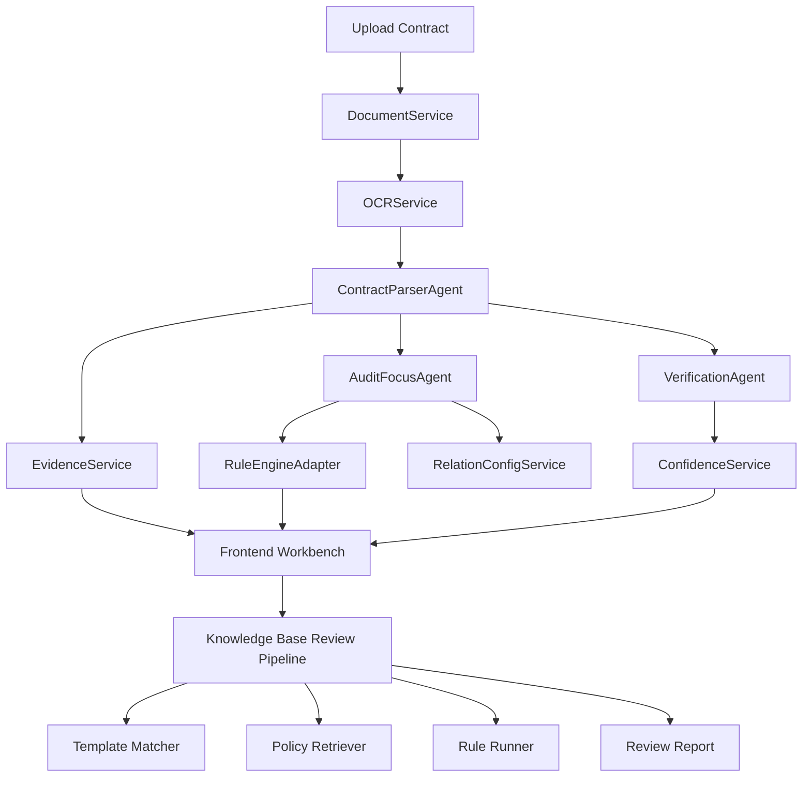

# Architecture

## Overview

`Audit Agent Demo Kit` 由两个前端工作区和一个共享后端组成：

- 合同智能解析工作台
- 智能审查底座
- FastAPI Agent backend

二者共享任务、证据、关系配置、制度底座与规则校验结果。

## High-Level Flow

## Backend Modules

### Agents

- `ContractAgent`
  - 编排整体合同解析链路
  - 调度 OCR、结构理解、条款抽取、证据定位、关注点生成
- `ContractParserAgent`
  - 负责章节还原、条款标签识别、关键信息抽取
  - 支持拆批并行与上下文压缩
- `AuditFocusAgent`
  - 根据条款、关系配置、规则结果生成审计关注点
- `VerificationAgent`
  - 生成必备条款、关键词一致性、外部数据依赖等校验结果

### Services

- `QwenService`
  - 统一封装 OpenAI-compatible 文本 / 多模态调用
  - 负责 JSON 修复、Schema 校验、缓存与耗时日志
- `OCRService`
  - 管理文字件与扫描件链路
  - 支持 Qwen VL 与 Paddle 组合
- `EvidenceService`
  - 建立结果与原文 block / bbox 的映射
- `RuntimeModelProfileService`
  - 切换公网 / 内网模型档位
- `ReportPreviewService`
  - 制度审查报告预览与截图相关输出

### Review / Knowledge Base

- `ReviewPipeline`
  - 串联分类、范本匹配、字段抽取、制度检索、规则执行和问题生成
- `TemplateRetriever`
  - 根据合同类别和结构化结果匹配范本
- `PolicyRetriever`
  - 检索制度条款
- `RuleRunner`
  - 运行本地或外部规则引擎规则

## Frontend Areas

### Analysis Workspace

- 合同原件查看
- 章节树
- 条款标签
- 审计配置
- 审计关注点
- 校验与证据链
- Agent 过程日志

### Knowledge Base Workspace

- 制度上传
- 制度管理
- 规则管理
- 合同审查
- 审查报告

## Runtime Model Profiles

### Public Profile

- Text model: `deepseek-v4-flash`
- Vision model: `qwen-vl-plus`
- OCR strategy: `vl_primary`

### Internal Profile

- Text model: `Qwen3.6-35B-A3B-GGUF`
- Vision model: none
- OCR strategy: `paddle_primary`

## Evidence Strategy

证据定位采用两层思路：

- 语义层
  - 先通过模型识别章节、条款、关键字段
- grounding 层
  - 再把目标文本映射回 OCR blocks
  - 条款优先使用模型辅助 block grounding
  - 章节和摘要字段允许走本地快速定位兜底

这样可以把“理解”和“坐标定位”解耦，便于后续替换 OCR / VL / grounding 方案。

## Extension Points

- `RuleEngineAdapter`
  - 接入 GoRules / DMN / 自定义规则服务
- `RelationConfigService`
  - 注入用户配置的关系关注、规则校验、外部核验上下文
- `Enterprise / Knowledge adapters`
  - 企业关系库
  - 知识图谱
  - 内部主数据
  - RPA / API 查询

## Storage

- 本地任务与结果：`LocalStore`
- 制度 / 范本 / 规则 / 报告：Redis stores
- 上传与缓存：`backend/uploads/`
- 运行日志：`.run-logs/`
