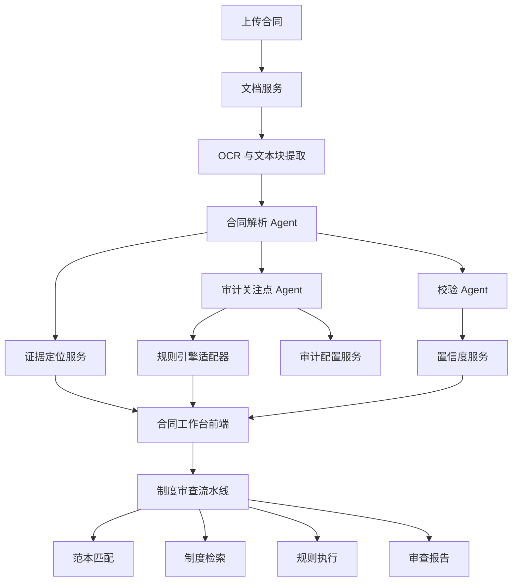

# 架构说明

## 总览

`合同审查 Agent Demo Kit` 由两个前端工作区和一个共享后端组成：

- 合同智能解析工作台
- 智能审查规则底座
- FastAPI Agent 后端

三者共享任务调度、证据映射、规则执行、制度检索与日志能力。

## 整体流程

## 后端模块

### Agents

- `ContractAgent`
  - 编排整体合同解析流程
  - 调度 OCR、结构理解、字段抽取、证据定位与审计生成
- `ContractParserAgent`
  - 负责章节还原、条款识别、关键字段抽取
  - 支持拆批并行与上下文压缩
- `AuditFocusAgent`
  - 结合条款结果、审计配置与规则结果生成审计关注点
- `VerificationAgent`
  - 生成完整性、一致性、证据链与外部依赖类校验结果

### Services

- `QwenService`
  - 统一封装兼容 OpenAI 协议的文本与多模态调用
  - 负责 JSON 修复、Schema 校验、缓存与调用日志
- `OCRService`
  - 管理文字件与扫描件链路
  - 支持多模态识别与 OCR 结果融合
- `EvidenceService`
  - 建立结构化结果与原文块、页码、坐标之间的映射
- `RuntimeModelProfileService`
  - 管理公网与内网模型链路切换
- `ReportPreviewService`
  - 生成制度审查报告预览与展示数据

### Reviewer / Rule Base

- `ReviewPipeline`
  - 串联分类、范本匹配、字段抽取、制度检索、规则执行与问题生成
- `TemplateRetriever`
  - 根据合同类型与结构化字段匹配范本
- `PolicyRetriever`
  - 检索制度条款与依据
- `RuleRunner`
  - 运行本地规则或外部规则引擎

## 前端工作区

### 合同智能解析工作台

- 合同原件查看
- 章节还原
- 条款标签
- 审计配置
- 审计关注点
- 校验与证据链
- Agent 过程日志

### 智能审查规则底座

- 制度上传
- 制度管理
- 规则管理
- 合同制度审查
- 审查报告

## 运行时模型档位

### 公网模式

- 文本模型：`deepseek-v4-flash`
- 多模态模型：`qwen-vl-plus`
- OCR 策略：`vl_primary`

### 内网模式

- 文本模型：`Qwen3.6-35B-A3B-GGUF`
- 多模态模型：无
- OCR 策略：`paddle_primary`

## 证据定位策略

证据定位采用两层解耦：

- 语义理解层
  - 先由模型识别章节、条款与关键字段
- 定位映射层
  - 再把目标文本回映射到 OCR blocks 或页内坐标
  - 条款类内容优先使用模型辅助的文本块匹配
  - 摘要类字段允许走快速文本对齐

这样可以把“理解”与“定位”拆开，后续替换 OCR、多模态模型或规则底座时，不需要重写整条链路。

## 审计配置与规则引擎

审计配置并不是直接替代结构化抽取，而是影响两类上下文：

- Agent 提示词上下文
  - 决定本轮应重点关注哪些关系、规则与外部核验方向
- 规则引擎输入上下文
  - 声明本轮规则需要哪些字段、阈值、触发条件与输出格式

如果新增配置依赖新字段，后端通过字段提取计划扩展抽取任务，再把结果注入规则执行载荷，而不是把字段名硬编码在前端页面里。

## 扩展点

- `RuleEngineAdapter`
  - 接入 GoRules、DMN 或自定义规则服务
- `RelationConfigService`
  - 注入关系关注、规则校验、外部核验等配置上下文
- `EnterpriseRelationAdapter`
  - 对接企业关系库与主数据
- `KnowledgeGraphAdapter`
  - 对接图谱查询
- `RpaApiAdapter`
  - 对接外部系统 API 或 RPA

## 存储

- 任务与结果：`LocalStore`
- 制度、范本、规则、报告：Redis 与本地索引
- 上传与缓存：`backend/uploads/`
- 运行日志：`.run-logs/`
